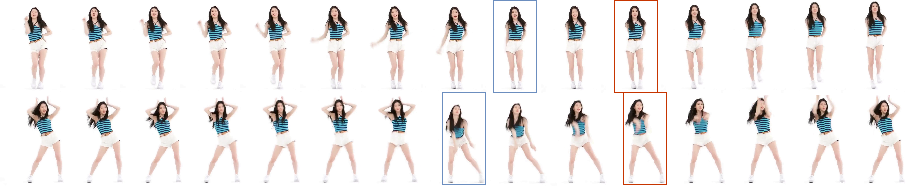

# Dance2MIDI: Dance-driven multi-instruments music generation




<p align="center">
  <a href='https://dance2midi.github.io/'>
  </a>


<p align="center">
<!-- <h1 align="center">InterDiff: Generating 3D Human-Object Interactions with Physics-Informed Diffusion</h1> -->
<strong>Dance2MIDI: Dance-driven multi-instruments music generation</strong></h1>
   <p align="center">
    <a href='' target='_blank'>Bo Han</a>&emsp;
    <a href='' target='_blank'>Yuheng Li</a>&emsp;
    <a href='' target='_blank'>Yixuan Shen</a>&emsp;
    <a href='https://rayeren.github.io/' target='_blank'>Yi Ren</a>&emsp;
    <a href='https://feilinh.cn/' target='_blank'>Feilin Han</a>&emsp;
    <br>
    Zhejiang University &emsp; National University of Singapore &emsp;
    ByteDance AI Lab &emsp; Beijing Film Academy
    <br>
  </p>
</p>


### 📥 [Dataset](https://drive.google.com/drive/folders/1vkuAw06Oh-tgDN9Cxtgdilw-IB8w6C4m?usp=sharing) 

PyTorch implementation of Dance2MIDI

## 📜 TODO List

- [x] Release the D2MIDI dataset
- [x] Release the demo video.
- [ ] Release the main codes for implementation.

## ⚙️ Implementation

Coming soon!

## 🤝 Citation

If you find this repository useful for your work, please consider citing it as follows:

```
@article{Han2024,
  title={Dance2MIDI: Dance-driven multi-instruments music generation},
  author={Bo Han, Yuheng Li, Yixuan Shen, Yi Ren, Feilin Han},
  journal={CVM},
  year={2024}
}
```
